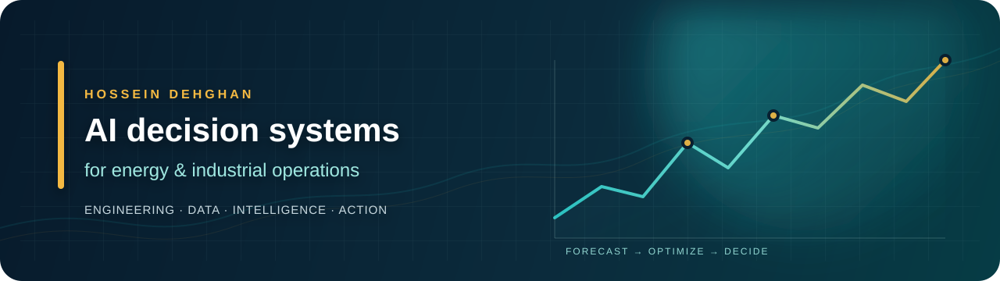

  

  
  
  

  <strong>Industrial Engineering</strong> &nbsp;·&nbsp;
  <strong>Forecasting</strong> &nbsp;·&nbsp;
  <strong>Optimization</strong> &nbsp;·&nbsp;
  <strong>Decision Support</strong>

## The short version

I build **AI-powered decision systems** for complex, real-world environments. My work combines industrial engineering, data science, and software delivery to turn operational and market data into **clear, auditable actions**—with a particular focus on **energy, industrial operations, and investment analysis**.

| 01 | 02 | 03 |
| :---: | :---: | :---: |
| **Frame the system** Decisions · constraints · outcomes | **Model the uncertainty** Data · forecasts · scenarios | **Ship the decision** APIs · dashboards · workflows |

## Start here

| I want to... | Go to... |
| --- | --- |
| See the flagship AI system | [GridWise AI — forecasting to constrained scheduling](https://github.com/hossiendehghan989/gridwise-ai) |
| Inspect transparent investment modeling | [AtlasRE — downside-first screening](https://github.com/hossiendehghan989/atlasre-investment-intelligence) |
| Review forecasting and sentiment experiments | [Tesla Stock Analysis](https://github.com/hossiendehghan989/Tesla-Stock-Analysis) |
| Suggest a technical improvement | [Open a GridWise discussion issue](https://github.com/hossiendehghan989/gridwise-ai/issues) |
| Read the publishing strategy | [GitHub Audience Content Kit](./CONTENT_KIT.md) |

## Featured systems

<table>
  <tr>
    <td width="50%" valign="top">
      <h3><a href="https://github.com/hossiendehghan989/gridwise-ai">GridWise AI</a></h3>
      
Energy intelligence that connects multi-horizon demand forecasting to scenario-based, constrained operating schedules.

      
<strong>Signal:</strong> 62.0 Wh RMSE · 0.53 R² on a chronological holdout · 100 Wh peak-reduction scenario

      
Python · scikit-learn · SciPy · FastAPI · Docker · Streamlit · CI

    </td>
    <td width="50%" valign="top">
      <h3><a href="https://github.com/hossiendehghan989/atlasre-investment-intelligence">AtlasRE</a></h3>
      
Transparent investment screening for real-estate decisions, designed around downside-first analysis.

      
<strong>Signal:</strong> Cash-flow modeling · debt constraints · LP/GP waterfalls · IRR/NPV · Monte Carlo risk

      
Python · Streamlit · Financial modeling · Underwriting

    </td>
  </tr>
  <tr>
    <td width="50%" valign="top">
      <h3><a href="https://github.com/hossiendehghan989/Tesla-Stock-Analysis">Tesla Stock Analysis</a></h3>
      
Reproducible research exploring historical market behavior through technical, sentiment, and machine-learning signals.

      
<strong>Signal:</strong> Feature engineering · XGBoost · LSTM · time-series experiments

      
Python · Jupyter · pandas · NumPy · XGBoost

    </td>
    <td width="50%" valign="top">
      <h3>Private builds</h3>
      
Energy-market intelligence, oil &amp; gas analytics, automation, and content workflows are also part of my current work.

      
<strong>Signal:</strong> Proprietary data and active deployments stay private; public repositories show the engineering approach.

      
Automation · APIs · analytics · operational workflows

    </td>
  </tr>
</table>

## Technical foundation

  
  
  
  
  
  
  
  

<strong>What I work on</strong>

 

- Explainable forecasting and optimization for energy and industrial applications
- Scenario analysis, constrained planning, and uncertainty-aware decision support
- Process analytics and operational improvement
- Reproducible machine-learning workflows and usable data products

<strong>How I build</strong>

 

> **Understand the system. Make assumptions explicit. Build the simplest useful solution. Measure the result.**

I value clear problem framing, trustworthy data, honest evaluation, and maintainable implementation. A model is only useful when it improves the decision around it.

 

  <a href="https://github.com/hossiendehghan989?tab=repositories"><strong>Explore all repositories →</strong></a>

